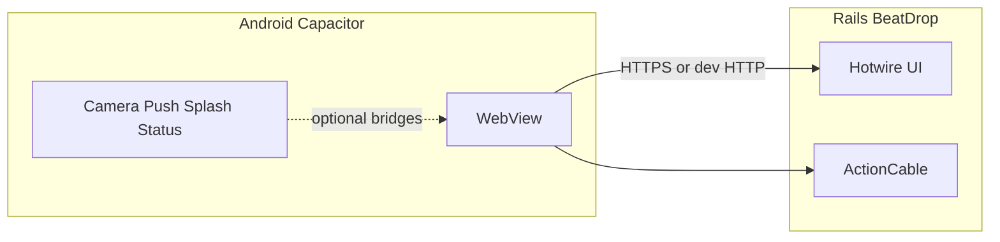

# Agent guide: BeatDrop player app (Capacitor + Android)

This document tells **coding agents** how the mobile layer fits the repo, what to build where, and which workflows to use. Read it before changing `mobile/`, the root `Makefile`, or player-facing Rails UI that must work inside the WebView.

## Product intent

BeatDrop is a **Rails 8 + Hotwire** app. The **player-facing mobile client** is a **Capacitor Android shell** that loads the **same web app** in a WebView (`server.url`). Native code supplies packaging, splash/icon, optional camera and push bridges—not a second React/Vue app.

Target experience:

| Area | Responsibility |
|------|----------------|
| Home, join/create game, room play, guesses, leaderboard, profile/settings | **Rails** views, Stimulus, Turbo, routes, policies |
| Scan card / enter code | **Rails** flows; use in-browser camera + JS where possible; escalate to `@capacitor/camera` only when the web API is insufficient |
| Real-time room state | **Rails** ActionCable (existing `RoomSessionChannel` pattern) |
| Push notifications | **Capacitor** `@capacitor/push-notifications` + **Rails/backend** FCM/Web Push delivery (to be wired) |
| Installable APK/AAB, icons, splash | **Android project** under `mobile/android/` + optional `@capacitor/assets` |

## Architecture (non-negotiable)



- **Single source of truth for UI and game logic:** Rails.
- **`mobile/www/`** is a **fallback** shell when `CAPACITOR_SERVER_URL` is unset at sync time; normal dev/prod uses **remote** `server.url`.
- **`server.url` is baked in at `npx cap sync` time** via env `CAPACITOR_SERVER_URL` (see `mobile/capacitor.config.js`).

## Repo map

| Path | Role |
|------|------|
| `Makefile` | Install deps, `cap sync`, open Android Studio, debug build; **`*-docker` targets** run npm/cap in Compose service `capacitor` (no conflict with `web` or icons `node`) |
| `docker-compose.yml` | `capacitor` service (profile `capacitor`): Node 22 + volume `capacitor_node_modules` for `mobile/` only |
| `mobile/package.json` | Capacitor CLI + core + plugins |
| `mobile/capacitor.config.js` | `appId`, `appName`, `webDir`, optional `server` from env |
| `mobile/www/` | Minimal static fallback (`index.html`) |
| `mobile/android/` | Gradle project, manifest, resources; run `make capacitor-sync` after plugin or config changes |
| `config/routes.rb` | Player routes: `root`, `games`, `rooms`, `r/:code`, `q/:token`, etc. |
| Root `package.json` | **Live room** React bundle: `npm install`, `npm run build` (or `build:prod`); output `app/assets/builds/live_room.js`. Dev: `npm run build:watch` via `Procfile.dev` + `bin/dev`. |
| `app/javascript/live_room/` | TypeScript + React + Zustand live room (guessing, steal, timers, QR, ActionCable). |
| `app/views/`, `app/javascript/controllers/` | Player UI—optimize for **mobile viewport** and touch |

## Agent skills you are expected to use

1. **Rails**: controllers, views (ERB/Slim), Stimulus, Turbo Streams, Devise, Pundit if present, mobile-friendly layouts.
2. **Capacitor**: `cap sync`, `cap open android`, plugin install, Android manifest permissions (merged from plugins), safe production config (HTTPS, cleartext off).
3. **Android (basics)**: Gradle assemble, emulator vs device networking, `usesCleartextTraffic` only when justified for dev HTTP.
4. **Web on mobile**: viewport meta, safe areas, touch targets, avoiding hover-only UX, camera/getUserMedia vs native camera.

## Standard workflows

### Install and sync

```bash
make mobile-install          # npm deps in mobile/
make capacitor-sync          # default CAPACITOR_SERVER_URL=http://10.0.2.2:3024 (emulator → host)
```

### Open IDE and run

```bash
make android-open            # sync + Android Studio
```

### Production-shaped sync

```bash
make capacitor-sync-prod PROD_SERVER_URL=https://your.production.host
```

### Physical device on LAN

```bash
make capacitor-sync CAPACITOR_SERVER_URL=http://YOUR_LAN_IP:3024
```

### Capacitor via Docker (no local Node for npm/cap)

Rails stays on **`web`**. Capacitor uses the **`capacitor`** service (Compose **profile `capacitor`**) so it never starts with plain `docker compose up`. Dependencies live in the named volume **`capacitor_node_modules`**, separate from the **`node`** service volume used for `icons/`.

```bash
make mobile-install-docker
make capacitor-sync-docker                    # CAPACITOR_SERVER_URL like host targets
make capacitor-sync-local-docker              # 127.0.0.1:3024
make capacitor-sync-prod-docker PROD_SERVER_URL=https://…
make android-open-docker                      # sync in Docker; `cap open` on host if npx exists
make clean-mobile-docker                      # drop capacitor_node_modules volume
```

Use **either** host `make capacitor-sync` **or** Docker `make capacitor-sync-docker` for ongoing work—mixing both for `mobile/node_modules` is confusing (Docker uses the volume, not your host `mobile/node_modules` folder).

The `capacitor` container runs **npm/cap as root** so installs work reliably into the named volume; **`make capacitor-sync-docker`** (and local/prod `-docker` variants) then runs **`make mobile-fix-android-perms`** so `mobile/android` on your host is **`chown`’d** to your UID for Android Studio / Gradle.

**Rails must listen on `0.0.0.0`** (Docker already does for port `3024`) so the emulator/device can reach it.

## Guardrails for agents

- **Do not** rebuild the whole player app as a SPA inside `mobile/` unless explicitly requested; that duplicates auth, routes, and Cable.
- **Player UI (mobile WebView):** avoid **`backdrop-filter`**, large **`transition-all`**, **`hover:scale`** on big controls, and **multi-stop full-screen gradients** on `body` / scroll regions — prefer **solid** or **simple** backgrounds and **`transition-colors`**. Audio progress bars should **not** animate width every frame (removed `transition-all` on those fills).
- **Do** add Stimulus controllers or small TS/JS under `app/javascript` for scan UX, haptics, etc., when it stays inside the WebView.
- **After** adding or removing Capacitor plugins or changing `capacitor.config.js`: run **`make capacitor-sync`** (or **`make capacitor-sync-docker`**) and verify Android build.
- **Release builds:** prefer **HTTPS** and remove or avoid relying on `android:usesCleartextTraffic="true"` (currently enabled for dev HTTP in `mobile/android/app/src/main/AndroidManifest.xml`—tighten for store release).
- **Changing `appId`:** coordinate with signing, Firebase (push), and Play Console; update `mobile/capacitor.config.js` and re-sync.

## Installed Capacitor plugins (extend deliberately)

Declared in `mobile/package.json`:

- `@capacitor/app` — lifecycle, back button behavior
- `@capacitor/camera` — native camera when web APIs are not enough
- `@capacitor/push-notifications` — register/deliver; needs FCM + server story
- `@capacitor/splash-screen` — splash control
- `@capacitor/status-bar` — status bar styling

Add new plugins with `npm install` in `mobile/`, then **`make capacitor-sync`**. Document new native permissions in this file when you add them.

## Android performance, Logcat, and WebView lifecycle

- **Skipped frames / Davey (multi‑second main-thread stalls)** while loading `http://10.0.2.2:3024` are often **Chromium + network + large dev pages** (many importmap requests, Turbo, ActionCable), not Gradle by itself. **Do not use `cap run android -l` (live reload)** when profiling scroll or startup; sync a normal `server.url` or test offline.
- **Isolate WebView vs network:** `make capacitor-sync-offline-docker` sets **`CAPACITOR_OFFLINE=1`** so **`server.url` is omitted** and the shell loads **`mobile/www/`** only. If scrolling is smooth offline but janky against Rails, optimize the **web app** (Network waterfall, heavy CSS like `backdrop-filter`, long tasks in JS). Offline mode is **not** the full BlindJam UI unless you copy a static build into `www/`.
- **JS errors and network:** Use desktop Chrome → **`chrome://inspect`** → inspect the WebView. Logcat alone misses infinite loops and failing fetches.
- **`Application attempted to call on a destroyed WebView`:** Usually **activity recreate**, **live reload**, or a **native/plugin callback** after teardown. Prefer stable runs without live reload; ensure Stimulus `disconnect()` cleans listeners (see `playback_host_controller.js`).
- **Plugins:** This repo does **not** register Push or native Camera at **Rails app startup**; `deck_scan` uses **getUserMedia** first. Unused plugins still add native code — remove from `mobile/package.json` if you want a leaner APK.
- **Bluetooth:** Push/WebView **do not require** `BLUETOOTH_*` permissions; declaring them without a BLE use‑case can confuse reviews and runtime. Add them only with a real feature + runtime permission flow.
- **Telemetry:** Optional: `npm run telemetry:off` in `mobile/` (or `npx cap telemetry off` in Docker) to reduce CLI noise.

## Player screen backlog (implementation hints)

Use Rails first; link from nav consistently for mobile.

| Screen | Likely Rails surface | Notes |
|--------|----------------------|--------|
| Home | `root`, `home#index` | Entry, CTAs to create/join |
| Join / create | `rooms#new`, `create`, `r/:code/join` | Short codes, validation errors visible on small screens |
| Scan / enter code | `q/*`, deck scan actions | Camera permission UX; fallback manual code field |
| Now playing | `rooms#show`, `games#show` | Large tap targets; minimize layout shift |
| Answer / guess | room/game member actions | Forms work with Turbo |
| Leaderboard | new or existing resource | JSON or HTML; keep Cable in mind if live |
| Profile / settings | Devise registrations, settings | Session cookies must work in WebView (SameSite / secure cookies for HTTPS prod) |

## Verification checklist (before claiming done)

- [ ] `make capacitor-sync` succeeds with the intended `CAPACITOR_SERVER_URL`.
- [ ] App loads Rails UI in emulator or device (not only `www/index.html` fallback).
- [ ] Critical flows work logged-in and logged-out as designed.
- [ ] New native features: permissions explained in UI; Android manifest merges as expected.
- [ ] Production: HTTPS, no unnecessary cleartext, push secrets not committed.

## References

- [Capacitor Android docs](https://capacitorjs.com/docs/android)
- [Capacitor config](https://capacitorjs.com/docs/config)
- [Android emulator networking](https://developer.android.com/studio/run/emulator-networking) (`10.0.2.2` → host loopback)
